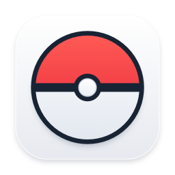

# Pokebar releases

Pokebar is the new name for the custom PokeTokenBar build maintained by
[actioneerhimi](https://github.com/actioneerhimi), based on
[chattymin/PokeTokenBar](https://github.com/chattymin/PokeTokenBar).

[Download the Pokebar 2.5.52 installer](https://github.com/actioneerhimi/poketokenbar-releases/releases/download/v2.5.52/Pokebar-2.5.52-Installer.dmg)
or [get the app ZIP](https://github.com/actioneerhimi/poketokenbar-releases/releases/download/v2.5.52/Pokebar-2.5.52.zip).
Open the DMG and drag **Pokebar → Applications**. For the ZIP, unzip it and move
Pokebar to Applications. The app and installer are signed with Developer ID and
notarized by Apple.

Bag & Shop now has **Type Eggs**, **Discovery Eggs**, and **1.5× / 2× / 3×
evolution boosters**. Each booster expires one hour after activation, even while
idle or with Pokebar closed. Battle items are removed from the store; existing
stock remains usable on player profiles.

Shiny Charm retains its permanent **30% shiny hatch chance**, and grey hover
tooltips remain removed.

Read [the release notes](https://github.com/actioneerhimi/poketokenbar-releases/releases/tag/v2.5.52)
or see [the latest release](https://github.com/actioneerhimi/poketokenbar-releases/releases/latest).

Requires macOS 14 or later. Supports Apple silicon and Intel Macs.

## Updating

**Versions 2.5.4 and later:** use Settings → App → Updates → Check now.
The update preserves your Pokémon progress and account. An in-app update may
keep the old application filename while changing the displayed name to Pokebar.

**Manual installation and versions through 2.5.3:** quit the old app, open the
installer DMG, and drag Pokebar onto its Applications shortcut. Choose Replace
if Finder asks about an existing `Pokebar.app`. Eject **Install Pokebar** after
copying and open Pokebar from Applications. If `PokeTokenBar.app` is still there,
remove that old application bundle after quitting it. Keep the app's Application
Support data; Pokebar reuses it. Older builds need this one manual installation
to enable the update channel.

Quit is in the **⋯ menu at the top of Settings**. Eligible players without a
published strategy receive **four Defends followed by six Attacks** automatically.
Existing custom strategies and withdrawals are preserved. Both players need an
active saved strategy, but their apps do not need to be open at the same time.

The [transparent Poké Ball mark](assets/pokebar-mark.svg) is available as an SVG.

This repository contains release information and app downloads. It is separate
from the original author's distribution channel and the private leaderboard server.
