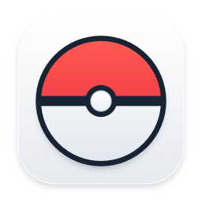
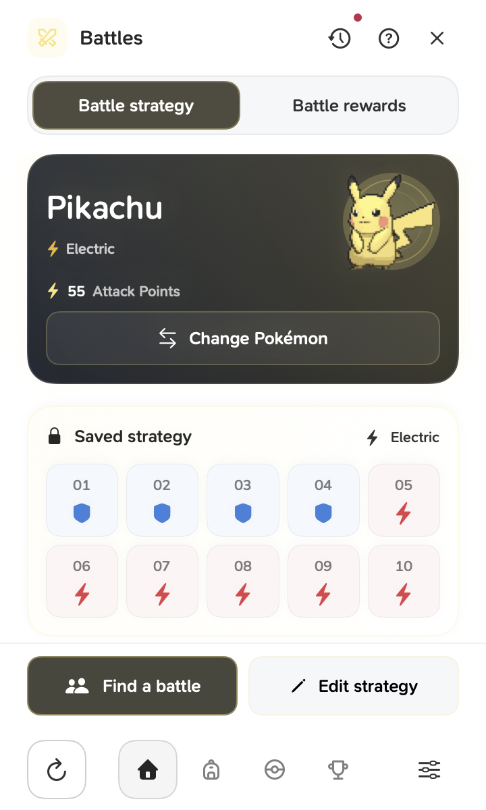

# Pokebar releases

Pokebar is the new name for the custom PokeTokenBar build maintained by
[actioneerhimi](https://github.com/actioneerhimi), based on
[chattymin/PokeTokenBar](https://github.com/chattymin/PokeTokenBar).

[Download the Pokebar 2.5.71 installer](https://github.com/actioneerhimi/poketokenbar-releases/releases/download/v2.5.71/Pokebar-2.5.71-Installer.dmg)
or [get the app ZIP](https://github.com/actioneerhimi/poketokenbar-releases/releases/download/v2.5.71/Pokebar-2.5.71.zip).
Open the DMG and drag **Pokebar → Applications**. For the ZIP, unzip it and move
Pokebar to Applications. The app and installer are signed with Developer ID and
notarized by Apple.

**Usage is checked on every sync.** Each report is credited up to a daily limit as it arrives, so progress within the limit evolves, hatches, and uses items normally. Usage above the limit is held for review, and a Pokémon whose growth claims more than the accepted usage stays locked until it catches up. Public rankings follow the same daily limit.

**Why a limit rather than a check with the provider:** the providers offer no way to confirm a subscription's usage, and every number the app reports comes from your own Mac. The limit bounds what any report can earn; identities, hatches, and battle admission remain server-owned.

Version **2.5.71** is required for a pending fresh collection start. Other accounts remain supported on 2.5.68 or later.

The existing interface is retained, including the shiny star inside the rarity badge. The white collection notice opens an explanation and stays hidden after reading. The collection notice reads **Usage on hold** when a day exceeds the limit.

Open the compact **Battle** icon from Home to **Change Pokémon**, **Edit strategy**, or **Find a battle**.
Pokémon choices show Attack Points, and strategy editing opens directly.

Click a Pokémon’s portrait in the **Pokédex** to hear its cry.
Pokémon play **Anime Cries voices** when available. The 531-recording pack
downloads automatically in the background on launch (47.5 MB once), then works
offline. Game cries remain available during the download and for missing voices.

Previously approved collections keep their identities and evolution progress. Confirmed tampering still applies **0.5× future game credit and a 72-hour battle suspension**. A held day or a queued backlog does not apply that penalty.

A modified client can still change its own local display. The server controls accepted Pokémon, growth, battle admission, and public progression; a local save is not proof of usage.

Version 2.5.71 applies assigned fresh eggs once after updating and syncing. The previous collection is backed up before the egg starts, and token totals and items are retained. It also includes the battle-win candy and held-XP fixes from 2.5.70. Assigned fresh collections require server-issued reward receipts for new bonus XP; editable candy and boost records do not authorize growth. Normal token progress continues within the usage limits.

Read [the release notes](https://github.com/actioneerhimi/poketokenbar-releases/releases/tag/v2.5.71)
or see [the latest release](https://github.com/actioneerhimi/poketokenbar-releases/releases/latest).

Requires macOS 14 or later. Supports Apple silicon and Intel Macs.

## Updating

**Versions 2.5.4 and later:** use Settings → App → Updates → Check for updates.
The update preserves your Pokémon progress and account. An in-app update may
keep the old application filename while changing the displayed name to Pokebar.

**Manual installation and versions through 2.5.3:** quit the old app, open the
installer DMG, and drag Pokebar onto its Applications shortcut. Choose Replace
if Finder asks about an existing `Pokebar.app`. Eject **Install Pokebar** after
copying and open Pokebar from Applications. If `PokeTokenBar.app` is still there,
remove that old application bundle after quitting it. Keep the app's Application
Support data; Pokebar reuses it. Older builds need this one manual installation
to enable the update channel.

Quit is in the **⋯ menu at the top of Settings**. Eligible players without a
published strategy receive **four Defends followed by six Attacks** automatically.
Existing custom strategies and withdrawals are preserved. Both players need an
active saved strategy, but their apps do not need to be open at the same time.

The [transparent Poké Ball mark](assets/pokebar-mark.svg) is available as an SVG.

This repository contains release information and app downloads. It is separate
from the original author's distribution channel and the private leaderboard server.
